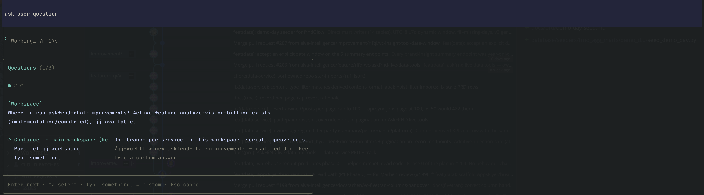
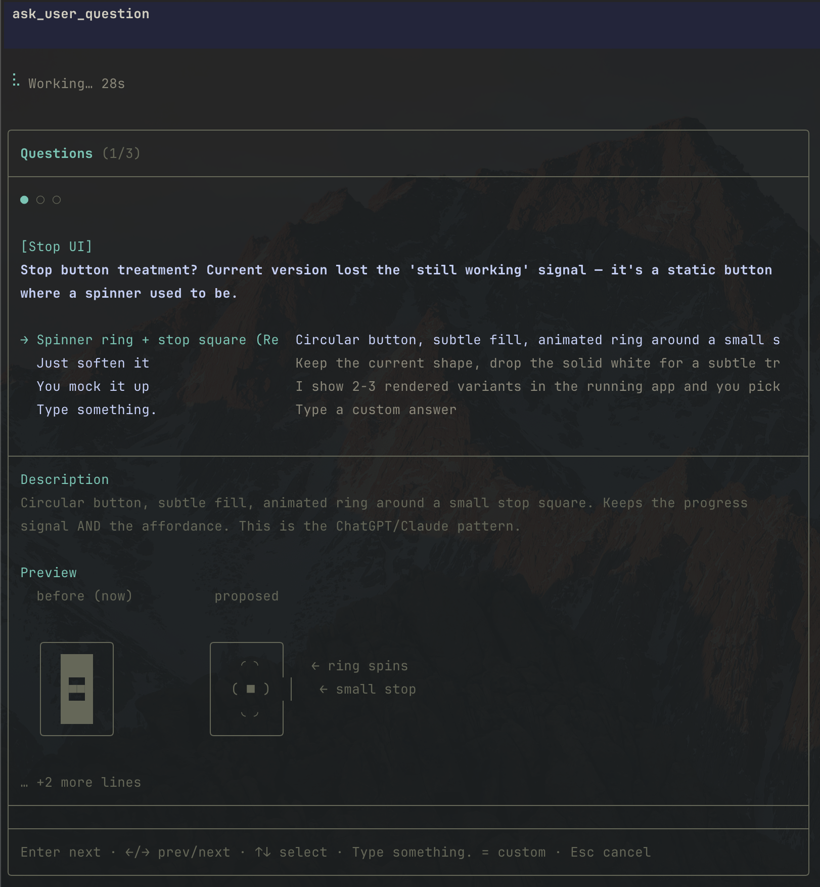

# @arhen/pi-core-ask

[](https://www.npmjs.com/package/@arhen/pi-core-ask)
[](./LICENSE)
[](https://github.com/earendil-works/pi)

## Install

Requires the [pi coding agent](https://github.com/earendil-works/pi) — install it first: `npm install -g @earendil-works/pi-coding-agent`.

```sh
pi install npm:@arhen/pi-core-ask
```

> Registers the `ask_user_question` tool. Only one extension may register it per session.

Minimalist pi questionnaire: `ask_user_question` tool with up to 4 structured questions per call — 2–4 options each, `multiSelect`, markdown `previews`, and an auto-appended "Type something." free-text row. Stateless: one tool, one dialog, no lifecycle machinery.

## Tool contract

- `questions` (1–4): `question`, `header` (≤16 chars), `options` (2–4 of `label` ≤60 chars / `description` / optional `preview`), `multiSelect` (default false)
- Reserved labels rejected: `Other`, `Type something.`, `Next` — the runtime appends its own free-text row
- Validation: duplicate questions/labels, too few options, too many questions — all rejected with the same error strings
- Envelope: `User has answered your questions: "Q"="A". selected preview: …` / `User declined to answer questions` on Esc

## UI

Boxed dialog, one question at a time: progress dots, header chip, option list (pi-tui SelectList), preview pane for focused options, "Type something." → inline input, `Enter` next / `Ctrl+S` done (multiSelect) / `Esc` cancel.



Preview pane with a side-by-side comparison grid for the focused option:



```
Questions (1/3)           ● ○ ○          [Workspace]
Where to run ask frnd-chat-improvements? Active feature analyze-vision-billing exists…

→ Continue in main workspace (Re…
  Parallel ej workspace
  Type something.
─────────────────────────────────────────────
Enter next ↵ select → Type something. = custom ⇫ Esc cancel
```

## Design

- One tool, one boxed dialog, stateless — no lifecycle events, no config, no RPC fallback, no i18n
- Multi-question questionnaire: progress dots, `←/→` navigation (answers preserved per question), `Enter` next, `Ctrl+S` commits multiSelect, `Esc` cancels
- Options via pi-tui SelectList; focused option's full description + optional preview render in a pane below
- "Type something." free-text row on every question; blank submit returns to options
- Validation: reserved labels rejected (trimmed), previews only on single-select, 2-4 options, unique questions/labels
- Envelope: `User has answered your questions: "Q"="A".` / decline on Esc

## Development

```sh
bun install
npx tsc --noEmit
bun test   # pure-logic: validation guards + response envelope
```

## License

MIT.
